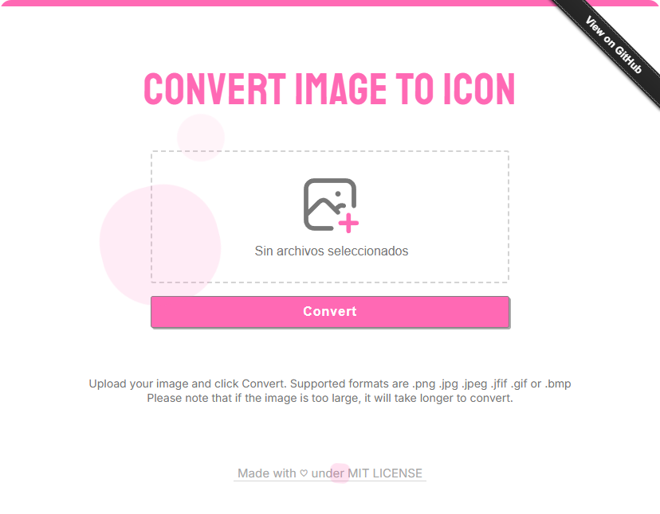

<h1 align="center">Image to Icon 🫧</h1>

Image to Icon is a web app to convert images to icon online.

 

## Features
- Does not cut or stretch the image.
- Simple interface, just a few clicks to convert.
- Supports **.png .jpg .jpeg .jfif .gif** or **.bmp**
- High resolution icon.

 

## Info
Credits can be found on the [about](https://genesistoxical.github.io/imagetoicon/about.html) page.

**MIT LICENSE** - Copyright (c) 2023 - 2025 Génesis Toxical
